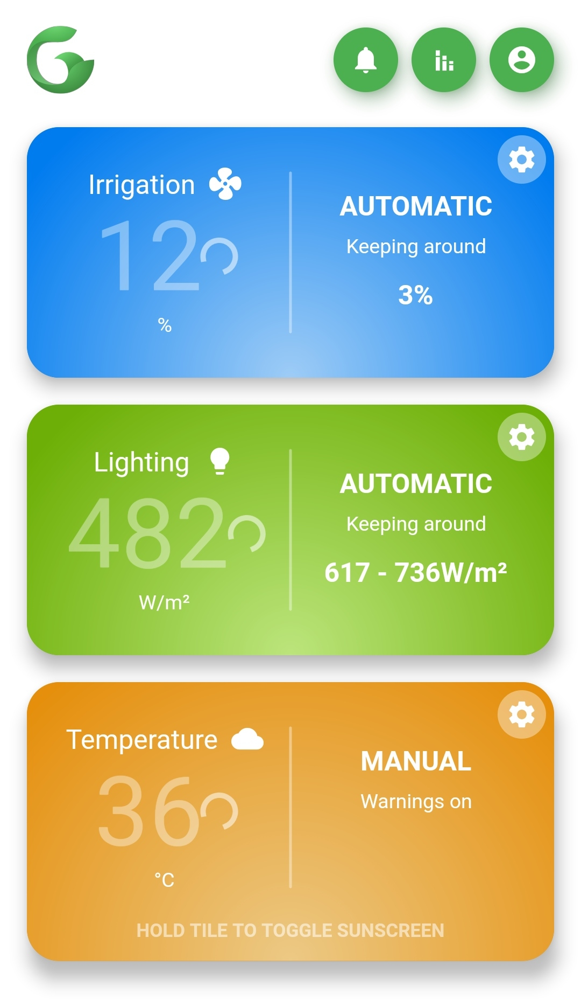
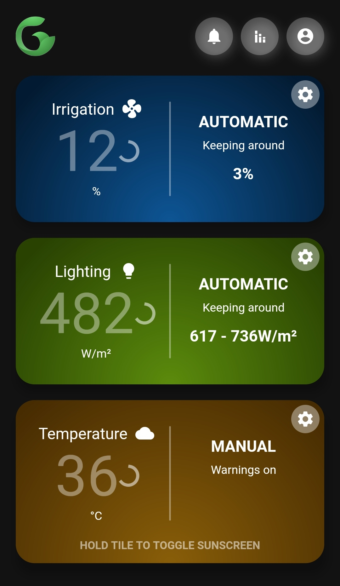

	
	

<table><tr>
<td>  </td>
<td>  </td>
</tr></table>

## Etymology
GReenhouse Automation SyStem using MQTT.

## What it is
This is a Flutter-powered Android application project made for the Multidisciplinary Project course of Semester HK202, Ho Chi Minh City University of Technology (HCMUT).

It aims to help make keeping a tabletop greenhouse a more hands-off experience by automating **watering, shading and lighting**, using some Micro:bit sensors and actuators.

### Modes
- Automatic: tries to keep readings within a preset range. Corrections are made through actuators when readings fall outside of the range. Even stronger corrections may be dispensed in case your greenhouse acts up severely.

- Scheduled: sticks to your plan (daily, weekly or monthly repeating periods). Acts as a middle-ground in case Automatic can't quite figure out how to keep your peculiar house plants happy.

- Manual: basically acts as a switch for you to control the devices. Probably only ever useful as a diagnostic tool.

### Devices
- A temperature sensor (this app is currently programmed against a DHT11);
- A soil moisture sensor;
- A light sensor;
- A pump (may be controlled via a relay);
- Some grow lamps (red LEDs much preferred for energy efficiency - although you're free to throw in some deep blue ones too);
- A motorised sunscreen, probably attached to a servo;
- An MQTT broker that's available 24/7. This app was developed with `io.adafruit.com` in mind;
- A Micro:bit controller to connect everything together;
- Associated peripherals and power source.
- An Android device, or install the emulator.

## Installing
Please go to the `Releases` section for the APK.

## Building
If you prefer building from source:
1. Get Android Studio.
2. Install the Dart and Flutter SDKs.
3. Install the Dart and Flutter plugins to Android Studio and make sure they can find your SDKs.
4. Run `flutter pub get` in this repo's root. It should install the packages this project needs.
5. Build with Android Studio.
	- Debug build lags due to having to run fancy animations on a VM, so don't freak out. Release builds easily lock onto 60fps using a four-year-old smartphone.
